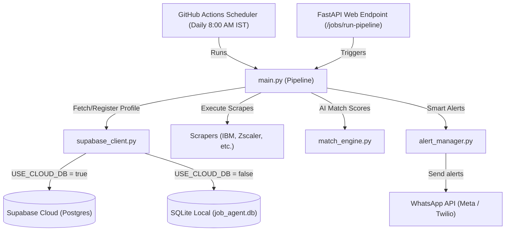

# Phase 4 — Cloud Database, FastAPI Backend, and Scheduler Walkthrough

This Phase introduces multi-user profile registration, moves persistent state from local SQLite to a free-tier **Supabase** cloud database, exposes a **FastAPI** REST API backend, and adds a **GitHub Actions** daily automated cron scheduler.

---

## What Was Built

### 1. Database Schema
- [supabase_schema.sql](file:///p:/New%20Project%20(Job%20search%20Agent)/ai-job-agent/database/supabase_schema.sql): PostgreSQL DDL definitions creating `users`, `jobs`, `job_matches`, `alerts_sent`, `scrape_logs`, and `error_logs` tables with indexes.

### 2. DB Client Adaptor
- [supabase_client.py](file:///p:/New%20Project%20(Job%20search%20Agent)/ai-job-agent/database/supabase_client.py): Dynamic client switching database execution based on the `.env` value of `USE_CLOUD_DB`. Supports legacy SQLite calls or multi-user cloud profiles seamlessly.

### 3. FastAPI REST Backend
- [main_api.py](file:///p:/New%20Project%20(Job%20search%20Agent)/ai-job-agent/api/main_api.py): REST API with endpoints to register users (`POST /users/register`), update profile targets (`PUT /users/{user_id}/profile`), read matches (`GET /jobs/matches/{user_id}`), and manually trigger the workflow (`POST /jobs/run-pipeline`) securely via `X-API-Key` headers.

### 4. Scheduler & Workflows
- [daily_job_search.yml](file:///p:/New%20Project%20(Job%20search%20Agent)/ai-job-agent/.github/workflows/daily_job_search.yml): Daily cron action running at 8:00 AM IST (2:30 AM UTC) to run all scrapers, LLM evaluations, and WhatsApp dispatch steps automatically.

### 5. central Error logs
- Critical exceptions are saved into the `error_logs` database table.
- Entire pipeline failures trigger emergency alerts to the coordinator WhatsApp number to ensure fail-safe operation.

---

## Architecture Flow

---

## Action Items Required

> [!IMPORTANT]
> To activate cloud persistence:
> 1. paste the content of [supabase_schema.sql](file:///p:/New%20Project%20(Job%20search%20Agent)/ai-job-agent/database/supabase_schema.sql) in your **Supabase SQL Editor** and click **Run**.
> 2. Run `pytest tests/test_phase4.py -v -s` locally to confirm the live connection and API endpoints evaluate cleanly.
